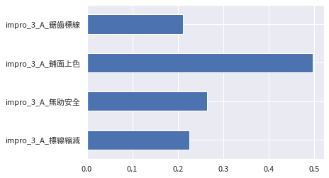
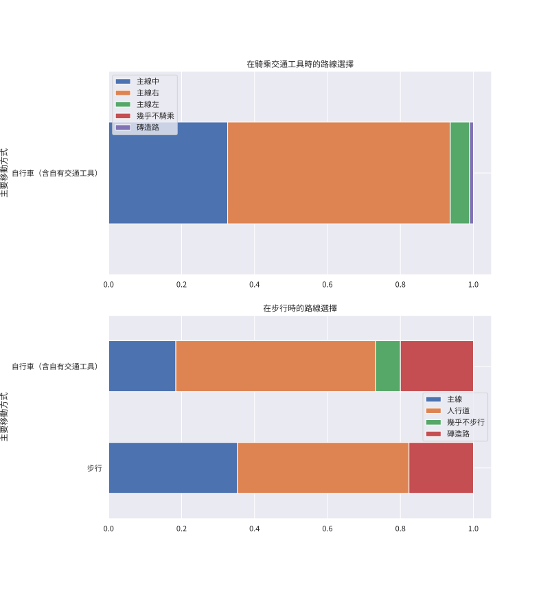
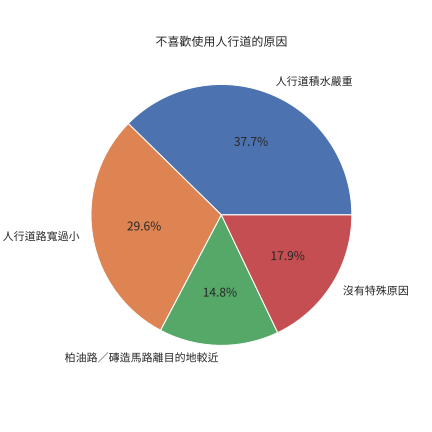
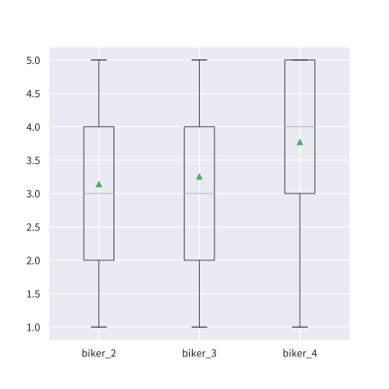
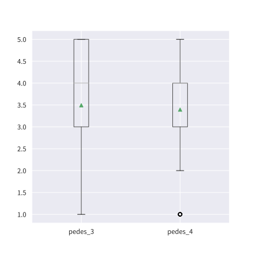
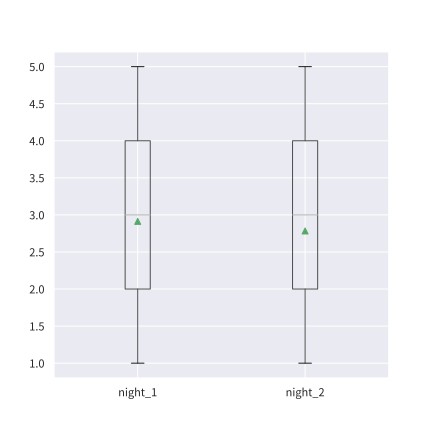

# 椰林大道交通改善問卷

## 所有樣本對於各改善措施的支持率

    

## 依交通工具分組對各改善措施的支持率

|                          | 鋪面上色 | 鋸齒標線 | 標線縮減 | 無助安全 |
| ------------------------ | -------- | -------- | -------- | -------- |
| 小客車                   | 0.00%    | 50.00%   | 0.00%    | 50.00%   |
| 步行                     | 55.88%   | 20.59%   | 23.53%   | 26.47%   |
| 滑板                     | 100.00%  | 100.00%  | 0.00%    | 0.00%    |
| 自行車（含自有交通工具） | 48.95%   | 20.00%   | 23.16%   | 26.32%   |
| 電動平衡車／滑板車       | 33.33%   | 33.33%   | 0.00%    | 33.33%   |
| 電動輪椅                 | 100.00%  | 100.00%  | 0.00%    | 0.00%    |

若僅保留步行與自行車騎士的填答資料：

|                          | 鋪面上色 | 鋸齒標線 | 標線縮減 | 無助安全 |
| ------------------------ | -------- | -------- | -------- | -------- |
| 步行                     | 55.88%   | 20.59%   | 23.53%   | 26.47%   |
| 自行車（含自有交通工具） | 48.95%   | 20.00%   | 23.16%   | 26.32%   |

## 行人不喜歡使用人行道的原因

## 騎士騎乘椰林大道的感受

| 代碼    | 題目（請問您對於以下敘述的認同程度？）                 |
| ------- | ------------------------------------------------------ |
| biker_2 | 機動車輛的行駛路線經常變動，使我難以維持原有的騎乘路線 |
| biker_3 | 椰林大道上的機動車輛使我被迫加速                       |
| biker_4 | 椰林大道上的機動車輛使我騎乘交通工具時感到危險         |

## 行人使用椰林大道的感受

| 代碼    | 題目（請問您對於以下敘述的認同程度？）           |
| ------- | ------------------------------------------------ |
| pedes_3 | 我必須要時時注意路況，才不會被自行車／機動車撞到 |
| pedes_4 | 我經常被突然竄出的自行車／機動車嚇到             |

## 用路人對椰林大道夜間狀況的評價

| 代碼    | 題目（請問您對於以下敘述的認同程度？）         |
| ------- | ---------------------------------------------- |
| night_1 | 目前椰林大道的夜間照明足夠讓我看清楚路上的來車 |
| night_2 | 目前椰林大道的夜間照明足夠讓我感到安心         |

